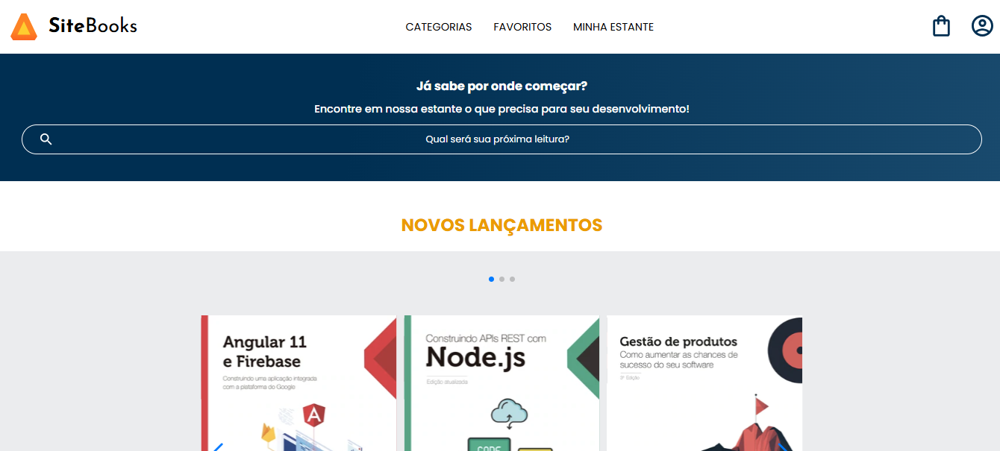

# 📚 SiteBooks – Projeto Front-end Responsivo

Este projeto simula uma livraria virtual moderna e responsiva chamada **SiteBooks**, desenvolvida com foco em boas práticas de HTML e CSS, além do uso de JavaScript com a biblioteca SwiperJS para carrosséis interativos.

---

## 🚀 Objetivo

O principal objetivo deste projeto foi aplicar os conceitos de **responsividade (mobile first)** e **componentização de estilos CSS**, utilizando uma estrutura limpa e modular.

---

## 🧰 Tecnologias Utilizadas

- **HTML5**
- **CSS3** (organizado em arquivos modulares):
  - `reset.css`
  - `banner.css`
  - `carrossel.css`
  - `contato.css`
  - `header.css`
  - `rodapé.css`
  - `topicos.css`
- **JavaScript** (com plugin)
- **SwiperJS** 
- **Google Fonts** 

---

## 🎨 Design e Estilo

- **Layout Mobile-First**, adaptável via *media queries*
- **Paleta de Cores:**
  - Azul degradê (`#002F52 → #326589`)
  - Laranja (`#EB9B00`)
  - Branco, cinza e preto
- **Fontes:**
  - `Poppins` (principal)
  - `Josefin Sans` (secundária para títulos)

---

## 📂 Estrutura de Pastas

📁 projeto/
├── index.html
├── reset.css
├── styles.css
├── banner.css
├── carrossel.css
├── contato.css
├── header.css
├── rodapé.css
├── topicos.css
├── /img/
│ └── (imagens utilizadas no layout)
└── /footer/
└── (logos e ícones do rodapé)

---

## 🧪 Funcionalidades

- Menu hamburguer e navegação por categorias
- Banner com campo de pesquisa
- Carrosséis com lançamentos e mais vendidos
- Cards informativos de livros e autores
- Seção de tópicos visitados recentemente
- Formulário de newsletter com campo de e-mail
- Rodapé com links institucionais e logos do ecossistema Alura

---

# URL
https://rchenrique.github.io/books_tablet_desktop/
